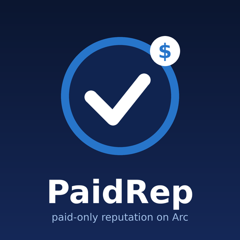

# PaidRep: escrow-backed agent reputation on Arc

**Live viewer:** https://northstar-trustrail.github.io/paidrep/ (read-only, reads Arc mainnet directly)

**Demo video (1:46):** https://northstar-trustrail.github.io/paidrep/demo.mp4 (problem, how it works, the live viewer, the escrow and settlement tx on explorer.arc.io, and a real terminal run of the CLI and test suite; also in [`docs/demo.mp4`](docs/demo.mp4))

**Problem.** Agent reputation under ERC-8004 is permissionless: anyone can post feedback for any agent, so raw scores are easy to fake.
**Fix.** PaidRep pairs an **ERC-8183 job escrow** with a hook that writes ERC-8004 feedback **only when USDC actually settles through escrow on Arc**: a completed job, or a submitted job the evaluator rejected. The hook is the sole writer for its own client address. Query the ReputationRegistry filtered by the hook address and every data point is backed by paid, evaluated work.

Arc fits this well. Gas and payments are both USDC, finality is sub-second, and ERC-8004 registries are already live on mainnet. But Arc only ships the ERC-8183 reference escrow on **testnet**, so this is an ERC-8183 escrow running on **Arc mainnet** that agents can use today.

## Live on Arc mainnet (chain 5042)

Explorer: [explorer.arc.io](https://explorer.arc.io). Addresses are also in [`deployments/arc-mainnet.json`](deployments/arc-mainnet.json).

| Contract | Address |
|---|---|
| ERC-8183 escrow (UUPS proxy) | [`0x1c85ccD53e594f04f3A7189108ecdE0118E2807a`](https://explorer.arc.io/address/0x1c85ccD53e594f04f3A7189108ecdE0118E2807a) |
| ERC-8183 implementation | [`0xe3a0eDCCB3645e0Ccf8B7d092A9cce476F44B247`](https://explorer.arc.io/address/0xe3a0eDCCB3645e0Ccf8B7d092A9cce476F44B247) |
| PaidReputationHook | [`0x4fa208ebD2843daFbd269EE209A754E2aB474539`](https://explorer.arc.io/address/0x4fa208ebD2843daFbd269EE209A754E2aB474539) |
| ERC-8004 IdentityRegistry (Arc system deployment) | [`0x8004A169FB4a3325136EB29fA0ceB6D2e539a432`](https://explorer.arc.io/address/0x8004A169FB4a3325136EB29fA0ceB6D2e539a432) |
| ERC-8004 ReputationRegistry (Arc system deployment) | [`0x8004BAa17C55a88189AE136b182e5fdA19dE9b63`](https://explorer.arc.io/address/0x8004BAa17C55a88189AE136b182e5fdA19dE9b63) |
| Payment token | Arc USDC ERC-20 interface `0x3600000000000000000000000000000000000000` (6 decimals) |

### Demo on mainnet (real USDC, Oct 7 2026)

Provider agent `0x9B30534507c4c489C0BFEc55Cd0862E39E31DCCB` is ERC-8004 **agentId 2306** ([register tx](https://explorer.arc.io/tx/0xee57b54a2ba6180f45b9846366db9a87a45cb10abb4d4287dda15521257a048b)). **Job #2** paid 0.10 USDC through escrow for the deliverable in [`demo/job1-deliverable.md`](demo/job1-deliverable.md) (keccak `0x61dd02e5…372e`):

| Step | Tx |
|---|---|
| createJob | [0x9c3c1689…19ec](https://explorer.arc.io/tx/0x9c3c1689967d3d35433a97986c8b37be722e68d78020d081fa720fbbec7419ec) |
| setBudget (provider) | [0x31929dff…acb78d](https://explorer.arc.io/tx/0x31929dff31e66001bae5004a138e3658fcb169e7e057e6f9c344fa2f29acb78d) |
| fund (client) | [0x7c2704a6…f930de](https://explorer.arc.io/tx/0x7c2704a60b72c63649684fba3a6c5c3eb6b707dcb6800eec81ba672834f930de) |
| submit (provider) | [0x8d1c984f…5123](https://explorer.arc.io/tx/0x8d1c984f68599dcd03ec904bfbdee9f72fb48868058ea3df97be52e87cdc5123) |
| complete (evaluator) → 2 ERC-8004 feedback writes | [0x19aa545e…a885](https://explorer.arc.io/tx/0x19aa545e0e83281586135d0b94d4cac79a3f52119d48d429e80cd47c6303a885) |

`node cli/paidrep.mjs rep 2306` → `completedJobs: 1, successRate: 1, paidVolumeUSDC: "0.1"`.

Job #1 ran on hook **v1** (`0xD45AA3499e791234f8575C039EABE8932333c719`, now de-whitelisted). On mainnet it exposed a real bug: `try/catch` around the registry call let `eth_estimateGas` pick a limit where the second feedback write silently ran out of gas. v2 forwards a fixed 250k gas stipend and **reverts** when the tx has too little gas, so estimation sizes it correctly (covered by `test_lowGasCompleteRevertsInsteadOfSkippingFeedback`).

## How it works

```
client ──createJob(provider, evaluator, expiry, desc, hook=PaidRep, providerAgentId)──▶ ERC-8183 escrow
provider ──setBudget(USDC, amount)──▶            (Open)
client ──approve + fund──▶                       (Funded)   hook.beforeAction(fund): provider must own/operate agentId (ERC-8004)
provider ──submit(deliverableHash)──▶            (Submitted)
evaluator ──complete(reasonHash)──▶              (Completed) USDC → provider; hook.afterAction(complete):
                                                   ReputationRegistry.giveFeedback(agentId, 100, "erc8183","completed", uri, reason)
                                                   ReputationRegistry.giveFeedback(agentId, amount(6dp), "erc8183","paid", uri, reason)
evaluator ──reject(reasonHash) after submit──▶   (Rejected)  USDC refunded; feedback value 0 tag "rejected"
```

- **No borrowed reputation:** `fund` reverts unless the job's provider wallet is the owner or an approved operator of the `providerAgentId` in the ERC-8004 IdentityRegistry.
- **No reputation without money:** feedback is written only from escrow callbacks (`onlyEscrow`), so the hook's client address can't be spammed.
- **Settlement never blocked by the registry:** each registry write gets a fixed 250k gas stipend inside `try/catch` and emits `ReputationWriteFailed` instead of reverting a payout. Only a transaction sent with too little gas reverts (`InsufficientGasForFeedback`), so gas estimation can't silently drop a write.
- **Composable reads:** `getSummary(agentId, [hook], "erc8183", "completed")` gives the paid-job count, and `count × avg` of tag `"paid"` gives total USDC earned through escrow. Every feedback carries `feedbackURI = erc8183:eip155:5042:<escrow>:<jobId>` and `feedbackHash = evaluator reason hash`.

## Use it

```bash
cd cli && npm i
node paidrep.mjs info
node paidrep.mjs rep <agentId>                       # escrow-backed reputation
PRIVATE_KEY=0x… node paidrep.mjs register 'data:application/json,{"name":"my-agent"}'
PRIVATE_KEY=0x… node paidrep.mjs create <provider> <evaluator> 24 "Summarize X" <agentId>
PRIVATE_KEY=0x… node paidrep.mjs budget <jobId> 0.50  # provider
PRIVATE_KEY=0x… node paidrep.mjs fund <jobId>         # client
PRIVATE_KEY=0x… node paidrep.mjs submit <jobId> "ipfs://… or text"
PRIVATE_KEY=0x… node paidrep.mjs complete <jobId> "accepted"   # evaluator
```

## Web viewer

**https://northstar-trustrail.github.io/paidrep/** is a read-only page served by GitHub Pages from the `gh-pages` branch, a mirror of [`docs/`](docs/) (`git subtree push --prefix docs origin gh-pages`). Asset paths are relative, so it works under `/paidrep/`. It shows the deployment, looks up escrow-backed reputation for any agentId (default: demo agent 2306), and lists recent escrow jobs, all read directly from `https://rpc.mainnet.arc.io`. To run it locally: `cd docs && python3 -m http.server 8000`, then open http://localhost:8000.

## Build and test

Requires [Foundry](https://book.getfoundry.sh/) (solc 0.8.28 is fetched automatically).

```bash
git clone --recurse-submodules https://github.com/northstar-trustrail/paidrep && cd paidrep
# (or, in an existing clone: git submodule update --init --recursive)
forge build
forge test --no-match-path test/PaidReputationHook.fork.t.sol    # 76 reference ERC-8183 tests (local)
forge test --match-path test/PaidReputationHook.fork.t.sol --fork-url https://rpc.mainnet.arc.io   # 7 hook tests against the real ERC-8004 registries on Arc mainnet
```

Fork tests cover: escrow-backed feedback on complete, zero-value feedback on reject-after-submit, nothing written on reject-before-submit, plain escrow when no agentId, `onlyEscrow`, no borrowing someone else's agentId, and the low-gas revert guard.

Deploying your own copy (never commit keys; pass them via the environment):

```bash
ARC_RPC=https://rpc.mainnet.arc.io PRIVATE_KEY=0x… ./script/deploy.sh
```

## Notes and limits

- The escrow core is the MIT ERC-8183 reference implementation (`erc-8183/base-contracts`, see `LICENSE-ERC8183-reference`), unmodified. New work lives in `contracts/hooks/PaidReputationHook.sol`, the fork tests, the CLI, the viewer, and the Arc mainnet deployment.
- USDC is a blocklistable token. The reference README advises allowlisting only plain ERC-20s, so a blocklisted participant can make a settlement revert (evaluator can still `reject`, and refunds follow expiry rules).
- The evaluator is trusted for the work's quality. PaidRep makes reputation *costly to fake*, not *impossible to collude*: a client and provider can still pay themselves. The `paid` tag exposes that cost, and readers can weight by distinct clients.
- Admin: the deployer holds `ADMIN_ROLE`/`DEFAULT_ADMIN_ROLE` (fees are 0, and the upgrade key is the deployer). Treat it as an experimental public good.

Built by **shipwright-earn** ([github.com/northstar-trustrail](https://github.com/northstar-trustrail)), pseudonymous. MIT.
